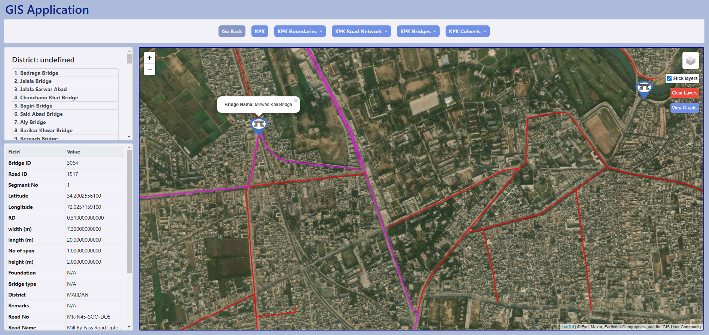

# Django GIS Project




<b>This is a Django-based project designed to work with geo-spatial data using GeoDjango, Javascipt mapping API's and a PostgreSQL/PostGIS database. It supports GIS functionalities such as visualizing Road Network, Bridges, Culverts, Rivers, Settlements data through mapping and implementing spatial queries to filter and access that data on the frontend of the application.</b>

---

## Project Demo


---

## Features
- **GeoDjango Integration**: Use GeoDjango for spatial data management.
- **PostGIS Support**: Leverage PostgreSQL with PostGIS for storing Shape files as a tabular representation of data and for geospatial queries.
- **Dynamic Mapping**: Display spatial data on interactive maps. (Leaflet Maps, OpenLayers)
- **Customizable Dashboards**: Visualize and filter data by regions or districts and view tabular attributes of entites along with graphical visualizations.

---

## Requirements

- Python 3.13+
- Django 5.x  
- PostgreSQL with PostGIS extension
- A postgis database with shape files uploaded as SQL tables.   
- A virtual environment (recommended)

---

## Setup Instructions

### 1. Clone the Repository
```bash
git clone https://github.com/moizmaj1k/gis-web-app-django.git
cd dashboard
```

### 2. Set Up a Virtual Environment
Windows 
```bash
python -m venv .venv
.venv\Scripts\activate
```
macOS/Linux
```bash
python -m venv .venv
source .venv/bin/activate
```

### 3. Install Dependencies
```bash
pip install -r requirements.txt
```

### 4. Set Up Environment Variables
Create a `.env` file in the root directory and add the following variables:
```bash
DATABASE_NAME=your_database_name
DATABASE_USER=your_username
DATABASE_PASSWORD=your_password
DATABASE_HOST=localhost
DATABASE_PORT=5432
```

### 5. Install Dependencies

Ensure PostgreSQL and PostGIS are installed and running. Create a database for the project

### 6. Apply Migrations
Run Django migrations to set up the database schema:
```bash
python manage.py migrate
```

### 7. Run the Development Server
Start the Django development server:
```bash
python manage.py runserver
```

---

## Usage

- Navigate to the application and use the interactive features for spatial data visualization.
- Use filters to view different geo-spatial data on the map.

---